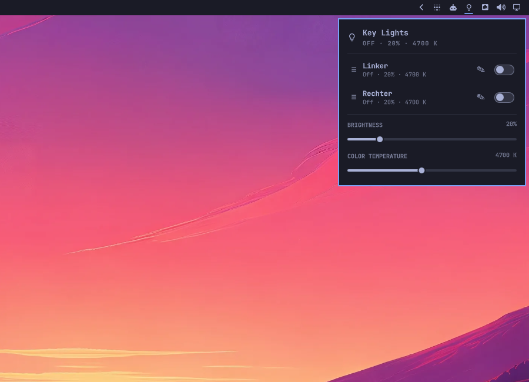

# Key Lights for Omarchy

An Omarchy bar plugin that automatically discovers and controls Elgato Key Lights on the local network.



## Quick start

```bash
omarchy plugin add https://github.com/Milofax/omarchy-keylights.git --enable
```

Once discovery completes, left-click the Key Lights icon to open the panel. Use `☰` to reorder a light, `✎` to rename it locally, and the switch at the right edge to turn it on or off. Names and ordering are saved automatically.

## Features

- Automatic discovery through the Elgato `_elg._tcp` mDNS service
- Individual on/off switches for every discovered light
- Persistent local aliases and control ordering, editable directly beside each light in the panel
- Shared brightness and color-temperature controls with explicit mixed-value states
- Short, bounded command retries with more patient background discovery
- A standalone bar icon while a light is on or needs attention, with an automatic system-tray fallback when every discovered light is reachable and off
- Setup flow for factory-reset lights through Elgato's local pairing page
- No Elgato Control Center installation required

## Requirements

- Omarchy with Quickshell plugin support
- `avahi`, `curl`, and `jq` for discovery and control
- Python 3 with `python-dbus` and `python-gobject` for the system-tray item
- The `omarchy.tray` widget present in the bar layout for the automatic tray fallback
- NetworkManager, Zenity, a Wi-Fi adapter, and a browser for first-time setup
- Key Lights and the Omarchy computer on the same local network

The control panel works without Elgato Control Center. First-time setup additionally requires `nmcli`, `zenity`, `xdg-open`, and a Wi-Fi adapter.

## Installation and updates

```bash
omarchy plugin add https://github.com/Milofax/omarchy-keylights.git --enable
```

The manifest places the widget in the right section of the bar by default.

Update an existing git-managed installation with:

```bash
omarchy plugin update io.github.milofax.keylights --yes
```

## Removal

```bash
omarchy plugin remove io.github.milofax.keylights --yes
```

The plugin does not create services, caches, or credential stores. Optional light aliases and ordering are stored in `~/.config/omarchy/keylights/preferences.json`, so they survive plugin updates. Removing the plugin does not remove that preferences file.

## Usage

- Left-click: open or close the control panel
- Middle-click: toggle every discovered light
- Right-click: turn every discovered light off
- Scroll: adjust shared brightness in 5% steps
- `R` in the panel: refresh discovery and state
- `S` in the panel: start setup
- `☰` beside a light: drag its complete control row up or down
- `✎` beside a light: edit its name directly in the panel; press Enter or `✓` to save

While at least one reachable light is on, the normal filled Key Lights icon occupies its standalone bar slot. When every discovered light is reachable and off, that slot collapses and Key Lights remains available as a white outline icon in Omarchy's system-tray drawer behind the chevron. Keep `omarchy.tray` in the bar layout so this fallback remains reachable. Discovery errors and unreachable lights retain the standalone bar button and mark it with a full `×` instead of disappearing. Hover the icon for the exact cause, then open the panel for details or actions. A smaller warning badge can still indicate setup availability. The tray item uses the same controls: left-click opens the panel, middle-click toggles all reachable lights, right-click turns them off, and scrolling adjusts shared brightness.

The brightness and color-temperature sliders control all reachable lights. If their current values differ, the panel displays **Mixed** until a shared value is selected. Color temperature is the light's configured setpoint, not a measured room temperature.

## Persistent data

Aliases and control ordering are stored in `~/.config/omarchy/keylights/preferences.json` with mode `0600`. Each record contains only the light's stable ID, discovery ID, local alias, and sort position.

- Renaming changes only the label shown by this plugin; it does not rename the light's firmware identity.
- Dragging a row saves the complete order atomically as soon as it is dropped.
- Preferences survive shell restarts, login sessions, plugin updates, and plugin removal.
- A configured light remains visible as **Not reachable** when it is absent from a discovery result.

To restore a discovered name and default ordering for one light, get its ID from `./bin/keylights json` and run:

```bash
./bin/keylights preferences clear DEVICE_ID
```

## Setup

Factory-reset a Key Light until it flashes three times, then choose **Set up** in the panel. The plugin connects the computer to the light's temporary Wi-Fi network, verifies the Elgato accessory API, and asks for confirmation before opening Elgato's local setup page. Network credentials are entered directly into that page and are never stored by this plugin. The previous network connection is restored on success, cancellation, error, or interruption.

Elgato exposes the setup page over unencrypted local HTTP. Only continue when the physical light you reset is flashing and its temporary Wi-Fi name matches the selected entry. The plugin cannot cryptographically authenticate a factory-reset light.

## CLI

The plugin includes its local driver at `bin/keylights`:

```bash
./bin/keylights json
./bin/keylights all status
./bin/keylights all toggle
./bin/keylights DEVICE_ID brightness 40
./bin/keylights DEVICE_ID temperature 4700
./bin/keylights setup
./bin/keylights control ACTION VALUE TARGETS_JSON
./bin/keylights preferences set DEVICE_ID DISCOVERY_ID POSITION NAME
./bin/keylights preferences clear DEVICE_ID
./bin/keylights preferences prompt DEVICE_ID DISCOVERY_ID POSITION CURRENT_NAME
./bin/keylights preferences order LIGHTS_JSON
```

`control` is the panel's snapshot-based internal interface. `VALUE` is `-` for actions without a value, and `TARGETS_JSON` is the validated endpoint array returned from panel state. Invalid actions, values, or targets exit with status 2 before device I/O; missing dependencies or discovery failures use status 3.

`preferences set` assigns a local display name and zero-based position to the stable and discovery IDs returned by `keylights json`; quote names containing spaces. `preferences clear` restores the discovered name and default alphabetical ordering. `preferences order` persists drag-and-drop ordering. `preferences prompt` remains available for command-line use, while the panel edits names inline. Preferences never change the light's firmware name. Saved aliases are accepted anywhere the human-readable CLI accepts a device target, for example `keylights Links status`.

Configured lights form a persistent local inventory. If one is absent from a single mDNS snapshot or temporarily offline, it remains in the panel as **Not reachable** instead of disappearing.

## Privacy and security

The plugin communicates only with Avahi, NetworkManager, and discovered Elgato lights on the local network. Discovery marks an endpoint reachable only after verifying the Elgato accessory API; unreachable advertisements may still appear as disabled panel rows. After a bounded command failure, the normal background refresh re-discovers and verifies changed endpoints before a later command uses them. The plugin does not contact a cloud service or store Wi-Fi credentials. Its optional preferences file contains only stable device IDs, aliases, and sort positions.

The tray helper owns one fixed name on the local session D-Bus, so multiple monitor instances cannot publish duplicate icons. Other monitor instances wait without respawning and take ownership if the active monitor disappears. The helper re-registers its existing item if the system-tray watcher restarts. It is started only while the standalone bar icon is hidden, unregisters on termination, and talks back to the existing panel through Omarchy's same-user IPC. Like every Omarchy IPC target, its setup and control methods are available to other processes running as the same user; this does not cross the operating system's user boundary. Background discovery polling runs only while the panel is open or at least one previously discovered light remains known.

Omarchy plugins run unsandboxed as the current user. Review plugin code before installation, as you would for any third-party Omarchy plugin.

## Troubleshooting

Start with the driver's machine-readable status:

```bash
./bin/keylights json | jq
```

- **A configured light is crossed out:** verify that it has power and still appears in `avahi-browse -rt _elg._tcp`. The row intentionally remains visible while unreachable.
- **Discovery works but control fails:** allow TCP port `9123` between the Omarchy computer and the light, including return traffic. Guest/IoT client isolation can allow reflected mDNS while still blocking control traffic.
- **The icon moves into the tray when everything is off:** this is the normal fallback. Ensure `omarchy.tray` is enabled and reveal its drawer using the bar chevron.
- **The panel shows stale state:** press `R` or reopen the panel. Background polling continues while a configured light remains known.
- **A factory-reset light is not offered for setup:** confirm that NetworkManager, Zenity, a browser, and a Wi-Fi adapter are available, then reset the light until it flashes three times.

## Development

Validate the repository with:

```bash
./tests/run
```

Development checks require `shellcheck`, `node`, `ripgrep`, `qmllint`, `qmltestrunner` (from Qt Declarative), `gdbus` (from GLib), `dbus-run-session`, and an Omarchy installation with its plugin validator. The suite replaces Avahi, curl, NetworkManager, Zenity, browser, and notification commands with temporary fixtures; it never contacts a real light or changes the host network. Qt Quick tests render the shipped light-row component offscreen and perform real mouse drag and rename-button interactions while asserting that neither path emits a light-toggle request. Tray ownership, restart, and SIGTERM lifecycle tests run on an isolated session D-Bus when one can be created. Set `KEYLIGHTS_TEST_REQUIRE_DBUS=1` to fail instead of skipping when that isolated bus is unavailable.

Agent skills are vendored on the `main` development branch under
`.agents/skills`, mirrored into Claude through tracked `.claude/skills`
symlinks, and locked by `skills-lock.json`. Run `bin/update-skills` to update
them or `bin/update-skills --check` to verify them. The public `plugin` branch
is the default and contains only the installable plugin payload because
Omarchy plugins may not contain symlinks. Release tags are cut exclusively
from that skill-free branch.

## License

MIT
